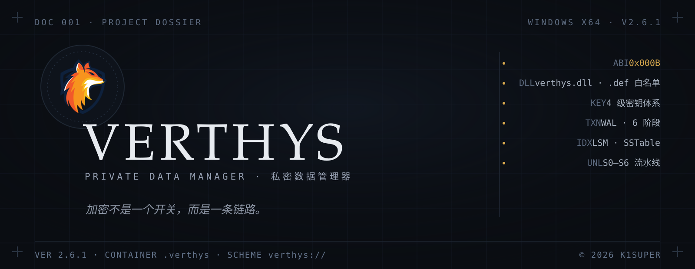
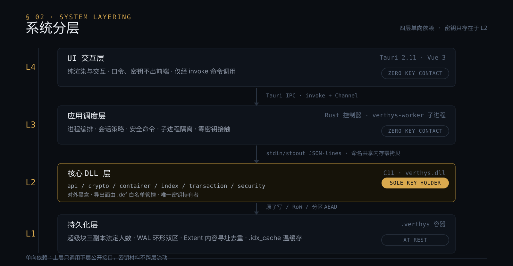

<<<<<<< HEAD

  § 00
  摘要
  ABSTRACT

Verthys 是一个面向 Windows 的私密数据管理器。敏感数据被封装进加密容器 <code style="background:#0E131B;border:1px solid #1E2733;border-radius:5px;padding:1px 6px;font-family:ui-monospace,SFMono-Regular,Consolas,monospace;font-size:0.92em;color:#C9D4E0">.verthys</code>，由 C 编写的安全核心 <code style="background:#0E131B;border:1px solid #1E2733;border-radius:5px;padding:1px 6px;font-family:ui-monospace,SFMono-Regular,Consolas,monospace;font-size:0.92em;color:#C9D4E0">verthys.dll</code> 承担从密钥守卫、安全解锁，到运行时完整性校验与窃密防护的全部职责。

项目坚持一条边界：<b style="color:#E7EBF0">密钥只存在于核心 DLL 层</b>。UI 与调度层从设计上就不接触任何密钥材料——这不是使用约定，而是分层约束。

<table style="width:100%;border-collapse:collapse;font-family:ui-monospace,SFMono-Regular,Consolas,monospace;font-size:14px;margin:20px 0 6px">
  <tr>
    <td style="border:1px solid #1E2733;background:#0E131B;padding:12px 16px;color:#5D6B80;width:25%">ABI&nbsp;&nbsp;0x000B</td>
    <td style="border:1px solid #1E2733;background:#0E131B;padding:12px 16px;color:#5D6B80;width:25%">容器&nbsp;&nbsp;V3</td>
    <td style="border:1px solid #1E2733;background:#0E131B;padding:12px 16px;color:#5D6B80;width:25%">超级块&nbsp;&nbsp;3 副本 · 2/3 法定</td>
    <td style="border:1px solid #1E2733;background:#0E131B;padding:12px 16px;color:#5D6B80;width:25%">解锁&nbsp;&nbsp;S0–S6</td>
  </tr>
  <tr>
    <td style="border:1px solid #1E2733;background:#0E131B;padding:12px 16px;color:#5D6B80">事务&nbsp;&nbsp;6 阶段</td>
    <td style="border:1px solid #1E2733;background:#0E131B;padding:12px 16px;color:#5D6B80">密钥&nbsp;&nbsp;4 级</td>
    <td style="border:1px solid #1E2733;background:#0E131B;padding:12px 16px;color:#5D6B80">轮换&nbsp;&nbsp;90d / 10k ops</td>
    <td style="border:1px solid #1E2733;background:#0E131B;padding:12px 16px;color:#5D6B80">产品&nbsp;&nbsp;2.6.1</td>
  </tr>
</table>

  § 01
  系统分层
  LAYERING

四层单向依赖，上层不接触密钥，下层不信任上层。Tauri 前端只 <code style="background:#0E131B;border:1px solid #1E2733;border-radius:5px;padding:1px 6px;font-family:ui-monospace,SFMono-Regular,Consolas,monospace;font-size:0.92em;color:#C9D4E0">invoke</code> 命令；Rust 控制器把全部 FFI 下沉到独立子进程 <code style="background:#0E131B;border:1px solid #1E2733;border-radius:5px;padding:1px 6px;font-family:ui-monospace,SFMono-Regular,Consolas,monospace;font-size:0.92em;color:#C9D4E0">verthys-worker</code>，二者以 stdin/stdout JSON 行协议通信，扫描结果经命名共享内存零拷贝传输。密钥与明文仅存在于 L2 及其下的 CNG 内核托管。

<ul style="margin:0 0 4px;padding-left:22px">
  <li style="color:#A8B2C0;margin:6px 0">L4 UI 交互层 — Tauri + Vue 3，纯渲染，口令、密钥不出前端。</li>
  <li style="color:#A8B2C0;margin:6px 0">L3 应用调度层 — Rust 控制器 + worker 子进程，进程编排 / 会话策略 / 安全命令，零密钥接触。</li>
  <li style="color:#A8B2C0;margin:6px 0">L2 核心 DLL 层 — C11 编写的 verthys.dll，六大子域：api / crypto / container / index / transaction / security，对外黑盒。</li>
  <li style="color:#A8B2C0;margin:6px 0">L1 持久化层 — .verthys 加密容器、pepper.bin、.idx_cache 温缓存。</li>
</ul>

  § 02
  容器格式
  CONTAINER / V3

一个 <code style="background:#0E131B;border:1px solid #1E2733;border-radius:5px;padding:1px 6px;font-family:ui-monospace,SFMono-Regular,Consolas,monospace;font-size:0.92em;color:#C9D4E0">.verthys</code> 容器就是一套自洽的小型存储引擎：

<table style="width:100%;border-collapse:collapse;font-size:14px;margin:0 0 6px">
  <tr>
    <td style="border:1px solid #1E2733;background:#0E131B;padding:12px 16px;font-family:ui-monospace,SFMono-Regular,Consolas,monospace;color:#D9A94E;width:22%">SUPERBLOCK</td>
    <td style="border:1px solid #1E2733;background:#0A0D12;padding:12px 16px;color:#A8B2C0">超级块三副本 + 2/3 法定人数提交与读取；副本损坏可触发恢复，而非丢失。</td>
  </tr>
  <tr>
    <td style="border:1px solid #1E2733;background:#0E131B;padding:12px 16px;font-family:ui-monospace,SFMono-Regular,Consolas,monospace;color:#D9A94E">PARTITION</td>
    <td style="border:1px solid #1E2733;background:#0A0D12;padding:12px 16px;color:#A8B2C0">分区管理，每个分区持有独立 AEAD 密钥。</td>
  </tr>
  <tr>
    <td style="border:1px solid #1E2733;background:#0E131B;padding:12px 16px;font-family:ui-monospace,SFMono-Regular,Consolas,monospace;color:#D9A94E">EXTENT</td>
    <td style="border:1px solid #1E2733;background:#0A0D12;padding:12px 16px;color:#A8B2C0">内容寻址存储：去重 + 引用计数，垃圾随事务回收。</td>
  </tr>
  <tr>
    <td style="border:1px solid #1E2733;background:#0E131B;padding:12px 16px;font-family:ui-monospace,SFMono-Regular,Consolas,monospace;color:#D9A94E">INDEX</td>
    <td style="border:1px solid #1E2733;background:#0A0D12;padding:12px 16px;color:#A8B2C0">LSM 索引：MemTable 跳表 + SSTable + 布隆过滤器 + 分级 Compaction。</td>
  </tr>
  <tr>
    <td style="border:1px solid #1E2733;background:#0E131B;padding:12px 16px;font-family:ui-monospace,SFMono-Regular,Consolas,monospace;color:#D9A94E">TXN</td>
    <td style="border:1px solid #1E2733;background:#0A0D12;padding:12px 16px;color:#A8B2C0">WAL 环形双区预写日志，六阶段事务：BEGIN → WRITE_EXTENT → UPDATE_INDEX → PREPARE → COMMIT → CONFIRM；崩溃后按序回放恢复。</td>
  </tr>
  <tr>
    <td style="border:1px solid #1E2733;background:#0E131B;padding:12px 16px;font-family:ui-monospace,SFMono-Regular,Consolas,monospace;color:#D9A94E">COMPAT</td>
    <td style="border:1px solid #1E2733;background:#0A0D12;padding:12px 16px;color:#A8B2C0">兼容 v1/v2 容器读取，提供 V1→V2 迁移接口。</td>
  </tr>
</table>

  崩溃不是异常，是它要处理的常态。

  § 03
  密钥体系
  KEY CHAIN

  口令
  →
  Argon2id · 胡椒
  →
  DKM
  →
  CNG · MEK
  →
  KeyA / KeyB / KeyC · 三权分立

<ul style="margin:0 0 4px;padding-left:22px">
  <li style="color:#A8B2C0;margin:6px 0">胡椒三源派生 — OS 托管 / 恢复卡 / 编译内嵌，恢复卡走 Shamir 分片。</li>
  <li style="color:#A8B2C0;margin:6px 0">机器绑定 — CNG 机器密钥硬件绑定（machine key / system32 加载器），防克隆迁移。</li>
  <li style="color:#A8B2C0;margin:6px 0">自动轮换 — 90 天 / 10k ops / DEGRADE 三类触发；V3 改密走 CNG 内核态轮换原语。</li>
  <li style="color:#A8B2C0;margin:6px 0">解锁流水线 — S0–S6 分阶段 + 预热缓存；渐进式解锁（MINIMAL_FIRST）最小可操作优先，索引预热转入后台，总超时 10s。</li>
  <li style="color:#A8B2C0;margin:6px 0">零残留 — 密码与密钥内存自动清零（zeroize），不落盘、不留痕。</li>
</ul>

  § 04
  纵深防御
  DEFENSE

纵深防御不是堆功能，而是让任何一条单点突破都无法直达密钥。

<table style="width:100%;border-collapse:collapse;font-size:14px;margin:0 0 6px">
  <tr>
    <td style="border:1px solid #1E2733;background:#0E131B;padding:10px 14px;font-family:ui-monospace,SFMono-Regular,Consolas,monospace;color:#D9A94E;width:9%">01</td>
    <td style="border:1px solid #1E2733;background:#0A0D12;padding:10px 14px;color:#E7EBF0;width:18%">进程防护</td>
    <td style="border:1px solid #1E2733;background:#0A0D12;padding:10px 14px;color:#A8B2C0">Job Object 双层隔离 · Mitigation Policy 沙盒 · worker 低优先级常驻</td>
  </tr>
  <tr>
    <td style="border:1px solid #1E2733;background:#0E131B;padding:10px 14px;font-family:ui-monospace,SFMono-Regular,Consolas,monospace;color:#D9A94E">02</td>
    <td style="border:1px solid #1E2733;background:#0A0D12;padding:10px 14px;color:#E7EBF0">硬件绑定</td>
    <td style="border:1px solid #1E2733;background:#0A0D12;padding:10px 14px;color:#A8B2C0">CNG 机器密钥 · system32 加载器</td>
  </tr>
  <tr>
    <td style="border:1px solid #1E2733;background:#0E131B;padding:10px 14px;font-family:ui-monospace,SFMono-Regular,Consolas,monospace;color:#D9A94E">03</td>
    <td style="border:1px solid #1E2733;background:#0A0D12;padding:10px 14px;color:#E7EBF0">Hook 防御</td>
    <td style="border:1px solid #1E2733;background:#0A0D12;padding:10px 14px;color:#A8B2C0">TLS 回调校验 · 篡改即销毁</td>
  </tr>
  <tr>
    <td style="border:1px solid #1E2733;background:#0E131B;padding:10px 14px;font-family:ui-monospace,SFMono-Regular,Consolas,monospace;color:#D9A94E">04</td>
    <td style="border:1px solid #1E2733;background:#0A0D12;padding:10px 14px;color:#E7EBF0">反分析</td>
    <td style="border:1px solid #1E2733;background:#0A0D12;padding:10px 14px;color:#A8B2C0">反调试 / 反注入 · 直接系统调用（SSN 排序 + W^X stub）</td>
  </tr>
  <tr>
    <td style="border:1px solid #1E2733;background:#0E131B;padding:10px 14px;font-family:ui-monospace,SFMono-Regular,Consolas,monospace;color:#D9A94E">05</td>
    <td style="border:1px solid #1E2733;background:#0A0D12;padding:10px 14px;color:#E7EBF0">内存防护</td>
    <td style="border:1px solid #1E2733;background:#0A0D12;padding:10px 14px;color:#A8B2C0">安全分配器 · 密钥分离 · 内存守卫</td>
  </tr>
  <tr>
    <td style="border:1px solid #1E2733;background:#0E131B;padding:10px 14px;font-family:ui-monospace,SFMono-Regular,Consolas,monospace;color:#D9A94E">06</td>
    <td style="border:1px solid #1E2733;background:#0A0D12;padding:10px 14px;color:#E7EBF0">完整性</td>
    <td style="border:1px solid #1E2733;background:#0A0D12;padding:10px 14px;color:#A8B2C0">构建期 .vsec 验签 · 运行时 .rhat 函数级哈希 · Verthys_VerifyIntegrity</td>
  </tr>
  <tr>
    <td style="border:1px solid #1E2733;background:#0E131B;padding:10px 14px;font-family:ui-monospace,SFMono-Regular,Consolas,monospace;color:#D9A94E">07</td>
    <td style="border:1px solid #1E2733;background:#0A0D12;padding:10px 14px;color:#E7EBF0">窃密防护</td>
    <td style="border:1px solid #1E2733;background:#0A0D12;padding:10px 14px;color:#A8B2C0">剪贴板守卫 · USB 防护 · 模块白名单（恶意 DLL 巡检 + Authenticode）· 后台巡检 · 会话守卫 · 防暴力破解</td>
  </tr>
  <tr>
    <td style="border:1px solid #1E2733;background:#0E131B;padding:10px 14px;font-family:ui-monospace,SFMono-Regular,Consolas,monospace;color:#D9A94E">08</td>
    <td style="border:1px solid #1E2733;background:#0A0D12;padding:10px 14px;color:#E7EBF0">应急响应</td>
    <td style="border:1px solid #1E2733;background:#0A0D12;padding:10px 14px;color:#A8B2C0">分级响应：TELEMETRY / DEGRADE / KILL</td>
  </tr>
</table>

  § 05
  外部边界
  ABI SURFACE

核心 DLL 对外的唯一契约是 <code style="background:#0E131B;border:1px solid #1E2733;border-radius:5px;padding:1px 6px;font-family:ui-monospace,SFMono-Regular,Consolas,monospace;font-size:0.92em;color:#C9D4E0">core/include/verthys.h</code>。加密算法、容器格式、内存防护与逆向对抗逻辑全部封装在内部，对外不可见。

<ul style="margin:0 0 4px;padding-left:22px">
  <li style="color:#A8B2C0;margin:6px 0">不透明句柄 <code style="background:#0E131B;border:1px solid #1E2733;border-radius:5px;padding:1px 6px;font-family:ui-monospace,SFMono-Regular,Consolas,monospace;font-size:0.92em;color:#C9D4E0">VerthysHandle</code> 隔离内部上下文，密钥与运行状态对上层不可见。</li>
  <li style="color:#A8B2C0;margin:6px 0">统一 32 位状态码，不对外输出内部调试信息与异常详情。</li>
  <li style="color:#A8B2C0;margin:6px 0">导出面唯一由 <code style="background:#0E131B;border:1px solid #1E2733;border-radius:5px;padding:1px 6px;font-family:ui-monospace,SFMono-Regular,Consolas,monospace;font-size:0.92em;color:#C9D4E0">verthys.def</code> 白名单管控；CI 以 dumpbin 导出面清单比对基线，任何新增符号都会让门变红（P0-A 回归门）。</li>
  <li style="color:#A8B2C0;margin:6px 0"><code style="background:#0E131B;border:1px solid #1E2733;border-radius:5px;padding:1px 6px;font-family:ui-monospace,SFMono-Regular,Consolas,monospace;font-size:0.92em;color:#C9D4E0">VERTHYS_API_VERSION 0x000B</code>，调用方编译期按宏版本协商能力。</li>
  <li style="color:#A8B2C0;margin:6px 0">消费方 verthys-worker 经 libloading 按名运行时解析，不依赖导入库。</li>
</ul>

  未列入白名单的符号，一律不可达。

  § 06
  构建
  BUILD

生产全量构建（C 核心 DLL → worker → Tauri NSIS 安装包 → 产物校验）：

<pre style="background:#0E131B;border:1px solid #1E2733;border-radius:10px;padding:14px 18px;color:#C9D4E0;font-family:ui-monospace,SFMono-Regular,Consolas,monospace;font-size:13.5px;line-height:1.7;overflow-x:auto;margin:0 0 16px"><code>powershell -ExecutionPolicy Bypass -File build_production.ps1</code></pre>

构建前清理所有构建目录：

<pre style="background:#0E131B;border:1px solid #1E2733;border-radius:10px;padding:14px 18px;color:#C9D4E0;font-family:ui-monospace,SFMono-Regular,Consolas,monospace;font-size:13.5px;line-height:1.7;overflow-x:auto;margin:0 0 16px"><code>powershell -ExecutionPolicy Bypass -File build_production.ps1 -Clean</code></pre>

开发模式（清理残留进程、校验依赖后启动 Tauri dev；运行前需已有 <code style="background:#0E131B;border:1px solid #1E2733;border-radius:5px;padding:1px 6px;font-family:ui-monospace,SFMono-Regular,Consolas,monospace;font-size:0.92em;color:#C9D4E0">build/core/Release/verthys.dll</code>）：

<pre style="background:#0E131B;border:1px solid #1E2733;border-radius:10px;padding:14px 18px;color:#C9D4E0;font-family:ui-monospace,SFMono-Regular,Consolas,monospace;font-size:13.5px;line-height:1.7;overflow-x:auto;margin:0 0 16px"><code>.\build_dev.ps1</code></pre>

仅构建核心 DLL（Release，跳过测试），并运行核心测试：

<pre style="background:#0E131B;border:1px solid #1E2733;border-radius:10px;padding:14px 18px;color:#C9D4E0;font-family:ui-monospace,SFMono-Regular,Consolas,monospace;font-size:13.5px;line-height:1.7;overflow-x:auto;margin:0 0 16px"><code>powershell -ExecutionPolicy Bypass -File scripts\build_core.release.ps1
ctest --test-dir build_dev -C Debug --output-on-failure</code></pre>

完整流程见 <a href="docs/GETTING_STARTED.md" style="color:#D9A94E;text-decoration:none">docs/GETTING_STARTED.md</a> 与 <a href="docs/BUILD.md" style="color:#D9A94E;text-decoration:none">docs/BUILD.md</a>；模糊测试开启方式见 <a href="docs/TESTING.md" style="color:#D9A94E;text-decoration:none">docs/TESTING.md</a>（<code style="background:#0E131B;border:1px solid #1E2733;border-radius:5px;padding:1px 6px;font-family:ui-monospace,SFMono-Regular,Consolas,monospace;font-size:0.92em;color:#C9D4E0">-DVERTHYS_ENABLE_FUZZ=ON</code>）。

  § 07
  技术栈
  STACK

<table style="width:100%;border-collapse:collapse;font-size:14px;margin:0 0 6px">
  <tr>
    <td style="border:1px solid #1E2733;background:#0E131B;padding:11px 16px;color:#E7EBF0;width:18%">核心安全库</td>
    <td style="border:1px solid #1E2733;background:#0A0D12;padding:11px 16px;color:#A8B2C0;width:40%">C11 · CMake ≥ 3.20 · MSVC</td>
    <td style="border:1px solid #1E2733;background:#0A0D12;padding:11px 16px;color:#5D6B80">verthys.dll，导出面 .def 白名单</td>
  </tr>
  <tr>
    <td style="border:1px solid #1E2733;background:#0E131B;padding:11px 16px;color:#E7EBF0">密码学与编解码</td>
    <td style="border:1px solid #1E2733;background:#0A0D12;padding:11px 16px;color:#A8B2C0">libsodium（vendored 静态链入）· Windows CNG · flatcc · xxHash</td>
    <td style="border:1px solid #1E2733;background:#0A0D12;padding:11px 16px;color:#5D6B80">AEAD / Argon2id / 容器编解码</td>
  </tr>
  <tr>
    <td style="border:1px solid #1E2733;background:#0E131B;padding:11px 16px;color:#E7EBF0">调度与主进程</td>
    <td style="border:1px solid #1E2733;background:#0A0D12;padding:11px 16px;color:#A8B2C0">Rust（edition 2021）· Tauri 2.11.5</td>
    <td style="border:1px solid #1E2733;background:#0A0D12;padding:11px 16px;color:#5D6B80">控制器 + verthys-worker 子进程</td>
  </tr>
  <tr>
    <td style="border:1px solid #1E2733;background:#0E131B;padding:11px 16px;color:#E7EBF0">前端</td>
    <td style="border:1px solid #1E2733;background:#0A0D12;padding:11px 16px;color:#A8B2C0">Vue 3.5.13 · TypeScript 5.6.2 · Vite 6.0.3</td>
    <td style="border:1px solid #1E2733;background:#0A0D12;padding:11px 16px;color:#5D6B80">纯渲染，零密钥接触</td>
  </tr>
  <tr>
    <td style="border:1px solid #1E2733;background:#0E131B;padding:11px 16px;color:#E7EBF0">质量</td>
    <td style="border:1px solid #1E2733;background:#0A0D12;padding:11px 16px;color:#A8B2C0">CTest · libFuzzer · CI（windows-latest）</td>
    <td style="border:1px solid #1E2733;background:#0A0D12;padding:11px 16px;color:#5D6B80">5 个 fuzz 目标各 10 分钟</td>
  </tr>
</table>

  § 08
  文档
  DOCS

<table style="width:100%;border-collapse:collapse;font-size:14px;margin:0 0 14px">
  <tr>
    <td style="border:1px solid #1E2733;background:#0E131B;padding:10px 16px;color:#E7EBF0;width:34%"><a href="docs/GETTING_STARTED.md" style="color:#D9A94E;text-decoration:none">GETTING_STARTED</a></td>
    <td style="border:1px solid #1E2733;background:#0A0D12;padding:10px 16px;color:#A8B2C0">首次构建与运行</td>
  </tr>
  <tr>
    <td style="border:1px solid #1E2733;background:#0E131B;padding:10px 16px;color:#E7EBF0"><a href="docs/ARCHITECTURE.md" style="color:#D9A94E;text-decoration:none">ARCHITECTURE</a></td>
    <td style="border:1px solid #1E2733;background:#0A0D12;padding:10px 16px;color:#A8B2C0">总体设计与模块职责</td>
  </tr>
  <tr>
    <td style="border:1px solid #1E2733;background:#0E131B;padding:10px 16px;color:#E7EBF0"><a href="docs/SECURITY_DESIGN.md" style="color:#D9A94E;text-decoration:none">SECURITY_DESIGN</a></td>
    <td style="border:1px solid #1E2733;background:#0A0D12;padding:10px 16px;color:#A8B2C0">信任模型 · 密钥链路 · 威胁建模</td>
  </tr>
  <tr>
    <td style="border:1px solid #1E2733;background:#0E131B;padding:10px 16px;color:#E7EBF0"><a href="docs/CORE_API.md" style="color:#D9A94E;text-decoration:none">CORE_API</a></td>
    <td style="border:1px solid #1E2733;background:#0A0D12;padding:10px 16px;color:#A8B2C0">核心 C ABI 接口契约</td>
  </tr>
  <tr>
    <td style="border:1px solid #1E2733;background:#0E131B;padding:10px 16px;color:#E7EBF0"><a href="docs/TESTING.md" style="color:#D9A94E;text-decoration:none">TESTING</a></td>
    <td style="border:1px solid #1E2733;background:#0A0D12;padding:10px 16px;color:#A8B2C0">测试分层与跑法</td>
  </tr>
  <tr>
    <td style="border:1px solid #1E2733;background:#0E131B;padding:10px 16px;color:#E7EBF0"><a href="docs/DEPLOYMENT.md" style="color:#D9A94E;text-decoration:none">DEPLOYMENT</a></td>
    <td style="border:1px solid #1E2733;background:#0A0D12;padding:10px 16px;color:#A8B2C0">打包 / 产物 / 分发</td>
  </tr>
  <tr>
    <td style="border:1px solid #1E2733;background:#0E131B;padding:10px 16px;color:#E7EBF0"><a href="docs/TROUBLESHOOTING.md" style="color:#D9A94E;text-decoration:none">TROUBLESHOOTING</a></td>
    <td style="border:1px solid #1E2733;background:#0A0D12;padding:10px 16px;color:#A8B2C0">症状 → 原因 → 排查 → 解决</td>
  </tr>
  <tr>
    <td style="border:1px solid #1E2733;background:#0E131B;padding:10px 16px;color:#E7EBF0"><a href="CHANGELOG.md" style="color:#D9A94E;text-decoration:none">CHANGELOG</a></td>
    <td style="border:1px solid #1E2733;background:#0A0D12;padding:10px 16px;color:#A8B2C0">版本变更记录</td>
  </tr>
  <tr>
    <td style="border:1px solid #1E2733;background:#0E131B;padding:10px 16px;color:#E7EBF0"><a href="SECURITY.md" style="color:#D9A94E;text-decoration:none">SECURITY</a></td>
    <td style="border:1px solid #1E2733;background:#0A0D12;padding:10px 16px;color:#A8B2C0">漏洞上报与安全策略</td>
  </tr>
</table>

完整索引（按角色分组）：<a href="docs/README.md" style="color:#D9A94E;text-decoration:none">docs/README.md</a>

  § 09
  治理与许可
  GOVERNANCE

<ul style="margin:0 0 4px;padding-left:22px">
  <li style="color:#A8B2C0;margin:6px 0">单分支开发：<code style="background:#0E131B;border:1px solid #1E2733;border-radius:5px;padding:1px 6px;font-family:ui-monospace,SFMono-Regular,Consolas,monospace;font-size:0.92em;color:#C9D4E0">v3-upgrade</code> 为当前工作分支，<code style="background:#0E131B;border:1px solid #1E2733;border-radius:5px;padding:1px 6px;font-family:ui-monospace,SFMono-Regular,Consolas,monospace;font-size:0.92em;color:#C9D4E0">master</code> 为保留基线。</li>
  <li style="color:#A8B2C0;margin:6px 0">提交规范：Conventional Commits 中文格式 <code style="background:#0E131B;border:1px solid #1E2733;border-radius:5px;padding:1px 6px;font-family:ui-monospace,SFMono-Regular,Consolas,monospace;font-size:0.92em;color:#C9D4E0">type(scope): 摘要</code>。</li>
  <li style="color:#A8B2C0;margin:6px 0">CI 质量门：core 构建 + 全部 C 测试 · libFuzzer 5 目标持续模糊 · 导出面白名单比对，任一不过即门红。</li>
  <li style="color:#A8B2C0;margin:6px 0">许可：专有软件，© 2026 K1Super（<a href="LICENSE" style="color:#D9A94E;text-decoration:none">LICENSE</a>）；第三方组件清单见 <a href="docs/THIRD_PARTY.md" style="color:#D9A94E;text-decoration:none">docs/THIRD_PARTY.md</a>。</li>
  <li style="color:#A8B2C0;margin:6px 0">贡献与评审流程：<a href="CONTRIBUTING.md" style="color:#D9A94E;text-decoration:none">CONTRIBUTING.md</a>。</li>
</ul>

  § 10
  命名与版本
  NAMING

<ul style="margin:0 0 4px;padding-left:22px">
  <li style="color:#A8B2C0;margin:6px 0">品牌名仅 <b style="color:#E7EBF0">Verthys</b>；容器扩展名 <code style="background:#0E131B;border:1px solid #1E2733;border-radius:5px;padding:1px 6px;font-family:ui-monospace,SFMono-Regular,Consolas,monospace;font-size:0.92em;color:#C9D4E0">.verthys</code>；事件 scheme <code style="background:#0E131B;border:1px solid #1E2733;border-radius:5px;padding:1px 6px;font-family:ui-monospace,SFMono-Regular,Consolas,monospace;font-size:0.92em;color:#C9D4E0">verthys://</code>；环境变量前缀 <code style="background:#0E131B;border:1px solid #1E2733;border-radius:5px;padding:1px 6px;font-family:ui-monospace,SFMono-Regular,Consolas,monospace;font-size:0.92em;color:#C9D4E0">VERTHYS_</code>；核心 DLL <code style="background:#0E131B;border:1px solid #1E2733;border-radius:5px;padding:1px 6px;font-family:ui-monospace,SFMono-Regular,Consolas,monospace;font-size:0.92em;color:#C9D4E0">verthys.dll</code>；公开 API 前缀 <code style="background:#0E131B;border:1px solid #1E2733;border-radius:5px;padding:1px 6px;font-family:ui-monospace,SFMono-Regular,Consolas,monospace;font-size:0.92em;color:#C9D4E0">Verthys_</code>。</li>
  <li style="color:#A8B2C0;margin:6px 0">产品版本 <b style="color:#E7EBF0">2.6.1</b>，在根 CMakeLists.txt、package.json、Cargo.toml 三处一致。</li>
  <li style="color:#A8B2C0;margin:6px 0">vcpkg.json 的 version-string 为 <code style="background:#0E131B;border:1px solid #1E2733;border-radius:5px;padding:1px 6px;font-family:ui-monospace,SFMono-Regular,Consolas,monospace;font-size:0.92em;color:#C9D4E0">3.2.6</code>——历史遗留值，仅作 vcpkg 清单标识，不用于产品版本判断。</li>
</ul>

  LAST UPDATED 2026-09-19 · 维护人 K1SUPER
  © 2026 K1SUPER · PROPRIETARY

=======
# Verthys
>>>>>>> c6ba26a814220d32222af14509b35f1e4a38895b
