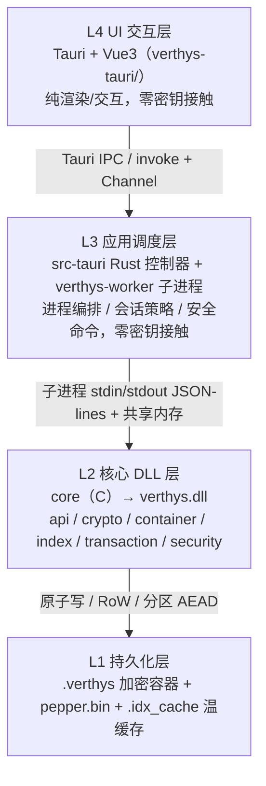
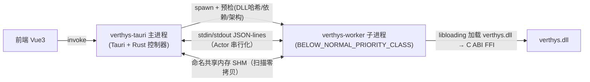

# ARCHITECTURE — Verthys 总体架构

> 梳理 Verthys 四层架构、core 六大子域职责、进程模型与 core/前端边界，作为全仓技术蓝图。
>
> Last updated: 2026-09-19 · 维护人：K1Super

---

## 1. 系统分层

Verthys 采用四层单向依赖架构。密钥与明文仅存在于核心 DLL 层（及其下 CNG 内核托管），上层不接触任何密钥材料。



要点：

- L4 纯渲染，仅通过 Tauri `invoke` 调用命令，口令、密钥不出前端。
- L3 由 `verthys-tauri`（Tauri 主进程）负责进程编排；具体 C 调用全部下沉到独立子进程 `verthys-worker`，主进程与 worker 间用 `stdin/stdout` JSON 行协议通信，扫描结果经命名共享内存零拷贝传输。
- L2 是对外黑盒：仅暴露 `verthys.h` 白名单 ABI（导出面由 `verthys.def` 白名单管控），加密算法、容器格式、内存防护均内部封装。
- L1 是磁盘持久化：`.verthys` 为唯一容器格式；pepper 由 OS 加密存储（`%APPDATA%\Verthys\pepper.bin`）；温缓存为 `.verthys.idx_cache`。

## 2. core 六大子域职责

> 以实际目录 `core/src/*` 为准。代码采用模块化镜像子目录（如 `api/lifecycle/`），非扁平单文件；与源稿《TARGET_ARCHITECTURE_V5.md》的扁平布局不同。

### 2.1 api/ — 公共 ABI 门面
`lifecycle/verthys_api.c` 承载全部 `Verthys_*` 导出；`lifecycle/verthys_v3_lifecycle.c` 负责 V3 创建/解锁/改密；`transfer/verthys_export_import.c` 负责导出/导入；`scan/verthys_scan.c` 提供扫描游标；`progress/verthys_progress.c` 提供解锁进度环形缓冲；`lifecycle/dllmain.c` 维护 TLS 标志；`unlock/verthys_unlock_pipeline.c` 实现 S0–S6 解锁流水线。

### 2.2 crypto/ — 密码原语与密钥管理
`cipher/verthys_crypto.c` 提供 AEAD / Argon2id / HKDF / HMAC 等原语；`keymanager/` 维护四级密钥体系（口令 → DKM → MEK → A/B/C 子密钥，见 [SECURITY_DESIGN.md](SECURITY_DESIGN.md)）；`cipher/verthys_crypto_cng.c` 封装 CNG AES-256-GCM 内核态 AEAD；`keymanager/keymanager_cng.c` 管理内核态密钥句柄生命周期（KERNEL_RESIDENT / REKEYING / DESTROYED 状态机）；`pepper/verthys_pepper.c` 维护胡椒三层来源与 Shamir 恢复卡；`rekey/verthys_rekey_auto.c` 实现自动密钥轮换；`cipher/secure_mem.c` 提供安全内存。

### 2.3 container/ — V3 容器格式
`shared/verthys_container_v3.h` 是 V3 常量与结构体单一事实源（`V3SB` 魔数、3 副本、法定人数）；`superblock/verthys_superblock_v3.c` 实现 3 副本超级块 + 法定人数提交/读取；`partition/verthys_partition.c` 管理分区与独立 AEAD 密钥；`extent/verthys_extent.c` 实现内容寻址 Extent（去重 + 引用计数）；`io/verthys_io.c` 是统一 64 位 I/O 层；`format/verthys_format.c` 兼容 v1/v2 格式读取。

### 2.4 index/ — 索引
`lsm/` 实现 V3 LSM 索引：`verthys_lsm.c` 主控、`verthys_lsm_memtable.c` 跳表 MemTable、`verthys_lsm_sstable.c` SSTable 读写 + 布隆过滤器、`verthys_lsm_compaction.c` 分级合并压缩。`warmcache/verthys_warmcache_v3.c` 实现温启动缓存（.idx_cache）读写。

### 2.5 security/ — 纵深防御
六层防线：`layer1_process_guard/job_isolation.c`（Job Object 隔离）、`layer3_hw_binding/`（cng_machine_key / hardware_binding / system32_loader，机器绑定）、`layer4_hook_defense/`（tls_loader / tls_callbacks / tamper_destroy，防 Hook）、`layer5_sandbox/process_sandbox.c`（进程 mitigation policy）、`layer6_closure/defense_closure.c`（7 路径闭环校验）；另有 `anti_analysis/`（anti_debug_v2 / anti_inject / syscall_direct 直接系统调用）、`memory/`（memory_guard / key_separation / secure_allocator）、`integrity/`（.vsec 验签 + .rhat 运行时哈希）、`emergency/`（三级应急响应）、`preset/`（安全预设双缓冲切换）。

### 2.6 transaction/ — 事务与一致性
`wal/verthys_wal.c` 提供 WAL 预写日志（环形区 + 崩溃恢复回放）；`txn/verthys_transaction_v3.c` 实现六阶段事务（BEGIN → WRITE_EXTENT → UPDATE_INDEX → PREPARE → COMMIT → CONFIRM）与 vsb_txn 超级块事务原语（begin/commit/rollback），配合超级块法定人数保证崩溃一致性。GC 以 Extent 引用计数 + 标记回收内嵌于 container/transaction 实现，无独立源文件（源稿列出的 `verthys_garbage.c` 实际不存在）。

## 3. Tauri 调度层职责

`verthys-tauri/src-tauri/src/controller/` 现有控制器文件（含 `mod.rs` 与公共类型）：

- `worker_controller.rs` — worker 子进程生命周期（预检/异步启动/就绪检测/健康监控/销毁）
- `verthys_controller.rs` — 容器主流程命令（unlock/create/lock/flush 等）
- `verthys_batch_controller.rs` — 批量记录/扫描命令
- `key_controller.rs` — 全局主密钥派生/验证
- `scan_controller.rs` — 扫描游标命令
- `file_controller.rs` — 文件类命令
- `diag_controller.rs` — 诊断/防御状态查询
- `device_controller.rs` — 设备信息
- `preflight_controller.rs` — 预检命令
- `clipboard_controller.rs` — 剪贴板守卫
- `api_error.rs` / `types.rs` — 错误码与响应类型

安全命令集中在 `security_commands/commands/`：

- `brute_force.rs`、`session.rs`、`usb.rs`、`file_lock.rs`、`module_whitelist.rs`、`preset.rs`、`cleanup.rs`
- 支撑模块：`security_commands/{audit,auth,path_resolver,persistence,responses,state,tests}.rs`；Rust 侧 `security/` 模块（`brute_force`、`session_guard`、`usb_guard`、`file_lock`、`module_whitelist`、`clipboard_guard`、`cleanup`、`background_patrol`）
## 4. 进程/线程模型

进程分工（与代码核实）：主进程 `verthys-tauri`（Tauri/Rust）作为唯一 UI 宿主；`verthys-worker.exe` 是独立子进程，承载 verthys.dll 与全部 FFI 调用。



关键事实（读 `worker_controller.rs` / `worker/session.rs` / `verthys-worker/src`）：

- 通信方式：主进程以 `tokio::process::Command` spawn 子进程，`stdin/stdout/stderr` 均 piped；请求/响应走 **stdin/stdout 单行 JSON 协议**（`protocol.rs` 的 `Request`/`Response`，`data`/`bin_data` 字段 base64）。就绪信号 `{"op":"ready"}` 由 worker 主动写入 stdout。
- 串行化：`WorkerSession` 内部为异步 Actor 模型，`mpsc` 请求通道 + 单 Actor 任务保证管道串行；解锁进度经 `unlock_progress` 行流式回传。
- 扫描零拷贝：`scan_open`/`scan_fetch` 用随机命名共享内存（`VirtualLock`）传输记录明文，避免 JSON/base64 膨胀；`scansummary` 用 4MB 摘要 SHM。
- 进程隔离/沙盒：worker 启动前（加载 DLL 前）先应用进程级 mitigation policy（`WIN32K_SYSTEM_CALL_DISABLE`、`PROCESS_CREATION_DISABLED`、`IMAGE_LOAD_PREFER_SYSTEM32`、`IMAGE_LOAD_NO_REMOTE`，经 `Verthys_NotifySandboxAttrs` 通知 DLL）；子进程挂入带 `KILL_ON_JOB_CLOSE` 的 Job Object，父进程退出即回收。
- 优先级：worker 以 `BELOW_NORMAL_PRIORITY_CLASS` + `CREATE_NO_WINDOW` 启动，承载后台长尾任务，避免抢占 UI。
- 生命周期：spawn 超时 15s、就绪等待超时 5s、健康检查每 10s、销毁前等待 IO 完成（2s）再终止；worker 销毁后主进程侧 `key_lifecycle` 重置为 NoKey（与“worker 内存无 GMK”事实一致）。

线程模型：主进程 Tauri 多线程 tokio 运行时；worker 为单线程主循环（stdin 读行 → dispatch → FFI）承载 DLL；DLL 内部为“主调用线程 + 固定后台线程池（≤4 worker）+ 定时器线程”，总线程数受限（见 [PERFORMANCE.md](PERFORMANCE.md)）。

## 5. core 与前端边界

- 唯一跨层契约：`core/include/verthys.h`（公共 C ABI，`VERTHYS_API_VERSION 0x000B`）与 Tauri command 清单。前者规范见 [CORE_API.md](CORE_API.md)，后者见 [TAURI_BRIDGE.md](TAURI_BRIDGE.md)。
- 数据流约定：前端只能 `invoke` 命令 → worker actor → FFI → C core；反向经 JSON 响应 / SHM / 进度回调。不得绕过 worker 直接加载 DLL。
- 密钥边界：口令经 worker 传入 `verthys.dll` 后即归属 L2，主进程不落盘、不缓存明文密钥（仅 Rust 侧 `locked_buffer` 短暂持有口令，用后清零）。

## 6. 关键设计决策（ADR 摘要）

> 完整记录见 [ARCHITECTURE_DECISIONS.md](ARCHITECTURE_DECISIONS.md)。下表为一句话摘要（编号沿用源稿，结论以代码为准）。

| 编号 | 一句话结论 |
|---|---|
| D-1 | 派生密钥经 CNG 内核托管，用户态仅持不可导出句柄，密钥明文不在用户态常驻 |
| D-2 | 采用 V3 容器（分区独立认证 + 内容寻址 Extent + LSM 索引），无历史兼容包袱 |
| D-3 | 超级块 3 副本法定人数（2/3）提交，消除单点损坏 |
| D-4 | 关键防御检测器走 `Nt*` 直接系统调用（syscall_direct）绕过用户态 Hook |
| D-5 | 密钥自动轮换（时间/操作计数/手动/异常触发），内核态完成 |
| D-6 | 密钥相关结构走专用安全分配器（VirtualAlloc + 锁页 + 清零） |

## 7. 目录结构速览

```
core/
├── include/                verthys.h（公共 ABI）· error_codes.h
├── schema/                 FlatBuffers schema（flatcc 编译，generated/）
├── src/
│   ├── api/                lifecycle/ transfer/ scan/ progress/ unlock/ shared/
│   ├── crypto/             cipher/ keymanager/ pepper/ rekey/
│   ├── container/          shared/ superblock/ partition/ extent/ io/ format/
│   ├── index/              lsm/ warmcache/
│   ├── transaction/        txn/ wal/
│   └── security/           anti_analysis/ emergency/ integrity/ layer1_process_guard/
│                           layer3_hw_binding/ layer4_hook_defense/ layer5_sandbox/
│                           layer6_closure/ memory/ preset/
├── tools/                  rhash_gen.c（.rhat 运行时哈希表构建工具）
└── tests/                  api/ container/ crypto/ index/ perf/ property/ regression/
                            schema/ security/ transaction/ fuzz/ · test_runner.c

verthys-tauri/src-tauri/src/
├── controller/             worker_controller · verthys_controller · key_controller ...
├── security/               brute_force · session_guard · usb_guard · file_lock · module_whitelist ...
├── security_commands/      commands/<brute_force,session,usb,file_lock,module_whitelist,preset,cleanup>.rs ...
├── state/                  verthys_session · key_lifecycle · worker_lifecycle ...
├── worker/                 actor/ session/ protocol/ platform ...
└── infrastructure/         shared_memory · ipc_secure · process_guard ...
verthys-tauri/verthys-worker/
└── src/                    main.rs · runtime/（worker/dispatch/protocol/scan_shm/gmk/...）· defense.rs · log.rs
```