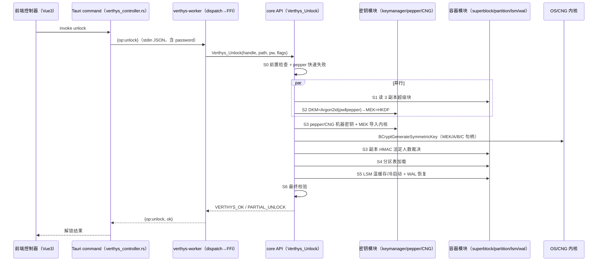
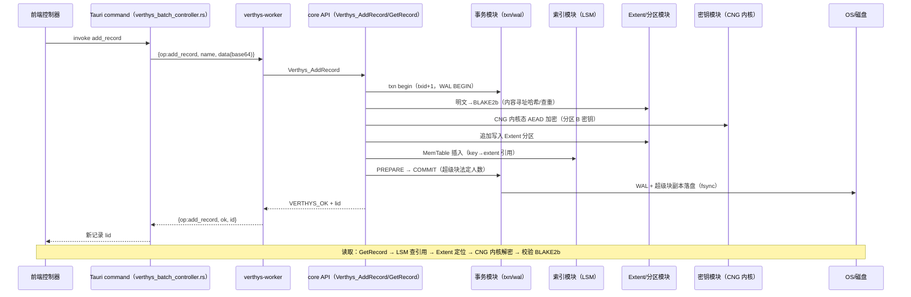
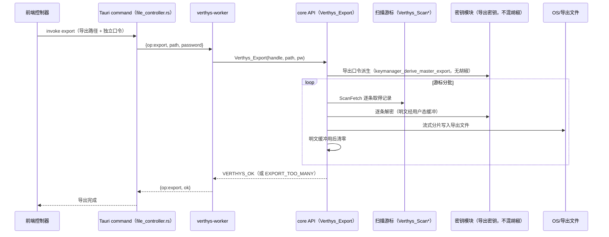
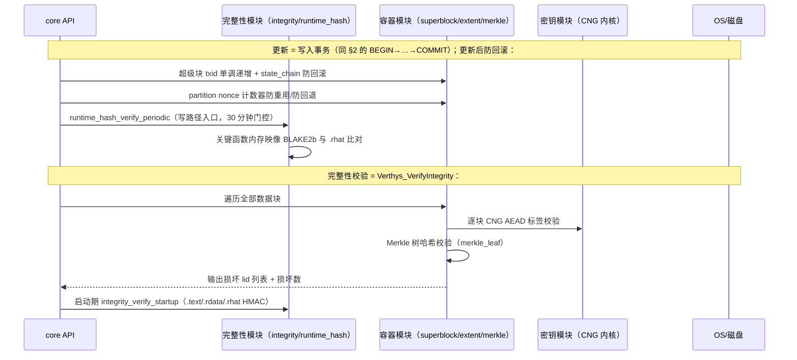

# DATA_FLOW — Verthys 关键数据流

> 用时序图说明解锁、加解密、导出、更新/完整性校验四类跨层数据流，标注各方参与模块。
>
> Last updated: 2026-09-19 · 维护人：K1Super

---

> 调用链约定：前端控制器 → Tauri command → worker actor（stdin JSON）→ core API（C ABI）→ 容器/密钥模块 → OS/存储。核心 API 契约见 [CORE_API.md](CORE_API.md)，桥接命令见 [TAURI_BRIDGE.md](TAURI_BRIDGE.md)。

## 1. 解锁流程

## 2. 加解密流程（单条记录写入 + 读取）

## 3. 数据导出流程

## 4. 更新/完整性校验流程

