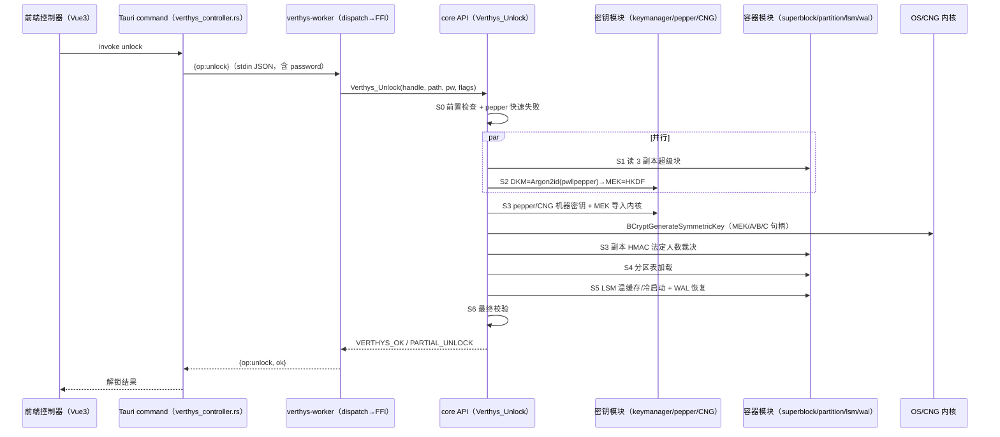
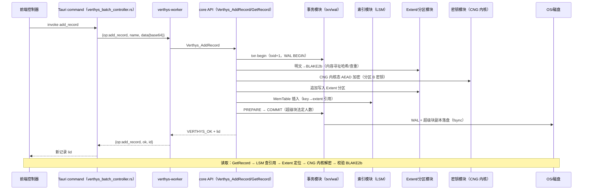
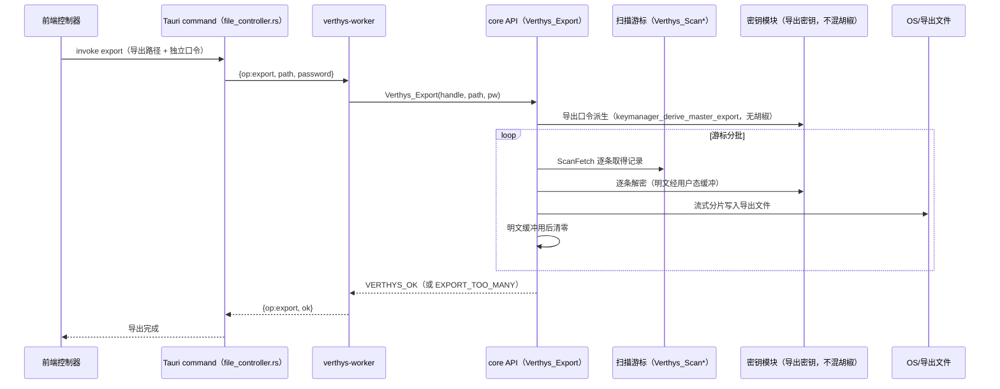
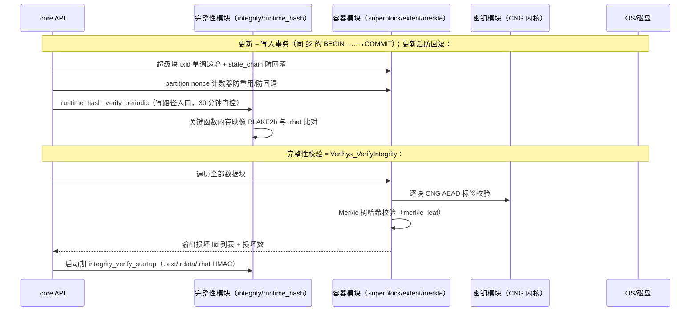
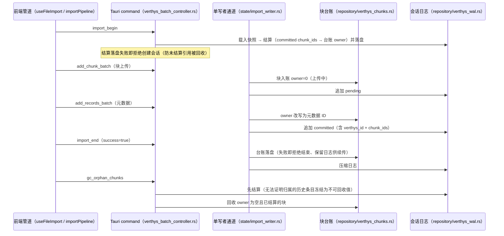

# DATA_FLOW — Verthys 关键数据流

> 用时序图说明解锁、加解密、导出、更新/完整性校验四类跨层数据流，标注各方参与模块。
>
> Last updated: 2026-09-28 · 维护人：K1Super

---

> 调用链约定：前端控制器 → Tauri command → worker actor（stdin JSON）→ core API（C ABI）→ 容器/密钥模块 → OS/存储。核心 API 契约见 [CORE_API.md](CORE_API.md)，桥接命令见 [TAURI_BRIDGE.md](TAURI_BRIDGE.md)。

## 1. 解锁流程

```mermaid
sequenceDiagram
    participant FE as 前端控制器（Vue3）
    participant TC as Tauri command（verthys_controller.rs）
    participant WK as verthys-worker（dispatch→FFI）
    participant API as core API（Verthys_Unlock）
    participant KM as 密钥模块（keymanager/pepper/CNG）
    participant CT as 容器模块（superblock/partition/lsm/wal）
    participant OS as OS/CNG 内核
    FE->>TC: invoke unlock
    TC->>WK: {op:unlock}（stdin JSON，含 password）
    WK->>API: Verthys_Unlock(handle, path, pw, flags)
    API->>API: S0 前置检查 + pepper 快速失败
    par 并行
        API->>CT: S1 读 3 副本超级块
        API->>KM: S2 DKM=Argon2id(pw‖pepper)→MEK=HKDF
    end
    API->>KM: S3 pepper/CNG 机器密钥 + MEK 导入内核
    API->>OS: BCryptGenerateSymmetricKey（MEK/A/B/C 句柄）
    API->>CT: S3 副本 HMAC 法定人数裁决
    API->>CT: S4 分区表加载
    API->>CT: S5 LSM 温缓存/冷启动 + WAL 恢复
    API->>API: S6 最终校验
    API-->>WK: VERTHYS_OK / PARTIAL_UNLOCK
    WK-->>TC: {op:unlock, ok}
    TC-->>FE: 解锁结果
```

## 2. 加解密流程（单条记录写入 + 读取）

```mermaid
sequenceDiagram
    participant FE as 前端控制器
    participant TC as Tauri command（verthys_batch_controller.rs）
    participant WK as verthys-worker
    participant API as core API（Verthys_AddRecord/GetRecord）
    participant TX as 事务模块（txn/wal）
    participant IDX as 索引模块（LSM）
    participant EXT as Extent/分区模块
    participant KM as 密钥模块（CNG 内核）
    participant OS as OS/磁盘
    FE->>TC: invoke add_record
    TC->>WK: {op:add_record, name, data(base64)}
    WK->>API: Verthys_AddRecord
    API->>TX: txn begin（txid+1，WAL BEGIN）
    API->>EXT: 明文→BLAKE2b（内容寻址哈希/查重）
    API->>KM: CNG 内核态 AEAD 加密（分区 B 密钥）
    API->>EXT: 追加写入 Extent 分区
    API->>IDX: MemTable 插入（key→extent 引用）
    API->>TX: PREPARE → COMMIT（超级块法定人数）
    TX->>OS: WAL + 超级块副本落盘（fsync）
    API-->>WK: VERTHYS_OK + lid
    WK-->>TC: {op:add_record, ok, id}
    TC-->>FE: 新记录 lid
    Note over FE,OS: 读取：GetRecord → LSM 查引用 → Extent 定位 → CNG 内核解密 → 校验 BLAKE2b
```

## 3. 数据导出流程

```mermaid
sequenceDiagram
    participant FE as 前端控制器
    participant TC as Tauri command（file_controller.rs）
    participant WK as verthys-worker
    participant API as core API（Verthys_Export）
    participant SC as 扫描游标（Verthys_Scan*）
    participant KM as 密钥模块（导出密钥，不混胡椒）
    participant OS as OS/导出文件
    FE->>TC: invoke export（导出路径 + 独立口令）
    TC->>WK: {op:export, path, password}
    WK->>API: Verthys_Export(handle, path, pw)
    API->>KM: 导出口令派生（keymanager_derive_master_export，无胡椒）
    loop 游标分批
        API->>SC: ScanFetch 逐条取得记录
        API->>KM: 逐条解密（明文经用户态缓冲）
        API->>OS: 流式分片写入导出文件
        API->>API: 明文缓冲用后清零
    end
    API-->>WK: VERTHYS_OK（或 EXPORT_TOO_MANY）
    WK-->>TC: {op:export, ok}
    TC-->>FE: 导出完成
```

## 4. 更新/完整性校验流程

```mermaid
sequenceDiagram
    participant API as core API
    participant INT as 完整性模块（integrity/runtime_hash）
    participant CT as 容器模块（superblock/extent/merkle）
    participant KM as 密钥模块（CNG 内核）
    participant OS as OS/磁盘
    Note over API,OS: 更新 = 写入事务（同 §2 的 BEGIN→…→COMMIT）；更新后防回滚：
    API->>CT: 超级块 txid 单调递增 + state_chain 防回滚
    API->>CT: partition nonce 计数器防重用/防回退
    API->>INT: runtime_hash_verify_periodic（写路径入口，30 分钟门控）
    INT->>INT: 关键函数内存映像 BLAKE2b 与 .rhat 比对
    Note over API,OS: 完整性校验 = Verthys_VerifyIntegrity：
    API->>CT: 遍历全部数据块
    CT->>KM: 逐块 CNG AEAD 标签校验
    CT->>CT: Merkle 树哈希校验（merkle_leaf）
    CT-->>API: 输出损坏 lid 列表 + 损坏数
    API->>INT: 启动期 integrity_verify_startup（.text/.rdata/.rhat HMAC）
```

## 5. 导入域数据流（会话 · 台账 · 去重跳过与结算）

图片（拾光）与文件（清藏）两条导入链路共用同一写入通道：全部写入经单写者
串行，块归属由台账记账，孤儿块回收前先与会话日志结算。

### 5.1 导入会话与台账结算（含 GC 守卫）

```mermaid
sequenceDiagram
    participant FE as 前端管道（useFileImport / importPipeline）
    participant TC as Tauri command（verthys_batch_controller.rs）
    participant IW as 单写者通道（state/import_writer.rs）
    participant LG as 块台账（repository/verthys_chunks.rs）
    participant WL as 会话日志（repository/verthys_wal.rs）
    FE->>TC: import_begin
    TC->>WL: 载入快照 → 结算（committed chunk_ids → 台账 owner）并落盘
    Note over TC: 结算落盘失败即拒绝创建会话（防未结算引用被回收）
    FE->>TC: add_chunk_batch（块上传）
    IW->>LG: 块入账 owner=0（上传中）
    IW->>WL: 追加 pending
    FE->>TC: add_records_batch（元数据）
    IW->>LG: owner 改写为元数据 ID
    IW->>WL: 追加 committed（含 verthys_id + chunk_ids）
    FE->>TC: import_end（success=true）
    IW->>LG: 台账落盘（失败即拒绝结束、保留日志供续传）
    IW->>WL: 压缩日志
    FE->>TC: gc_orphan_chunks
    TC->>WL: 先结算（无法证明归属的历史条目冻结为不可回收值）
    TC->>LG: 回收 owner 为空且已结算的块
```

### 5.2 去重跳过与删除释放

- **去重键**：`fileHash = BLAKE3(明文 ‖ 格式版本 ‖ 形态标志)`；键集合持久于会话日志。
- **导入**：键命中即文件级"去重跳过"（不计失败、不入列表、显式报告）；
  块级重传不保证幂等（加密形态每块随机 IV，密文互异）。
- **删除**：记录批量删除并落盘成功后执行 `forget_hashes`（日志追加删除墓碑）释放键，
  同一文件即可重新导入；释放失败转入待重试队列，由下次导入开始前补释放。
- **清藏删除**：块引用与元数据合并单次批量事务删除；删除提交后立即失效三层缓存
  并落盘。失败语义：删除失败保持原状可重试（零副作用）；落盘失败保持条目并提供
  "仅重放落盘"的重试入口（批量删除对缺失条目整体拒绝，删除步骤不可重放）；
  去重释放失败不改变删除结论。
- **内存口径**：分片读取上界 4MiB/次（越界即报错），块载荷在进程间层为 base64
  但受批量预算约束（≤11.19MiB/批）；导入/导出内存占用与文件大小无关。