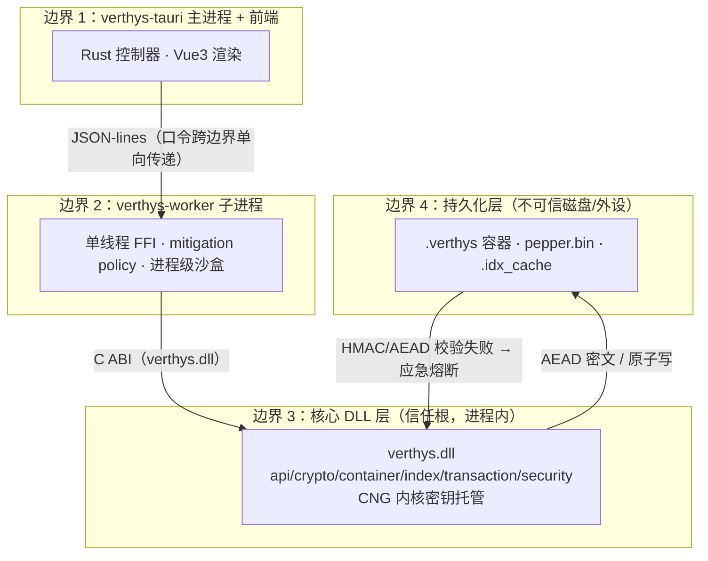
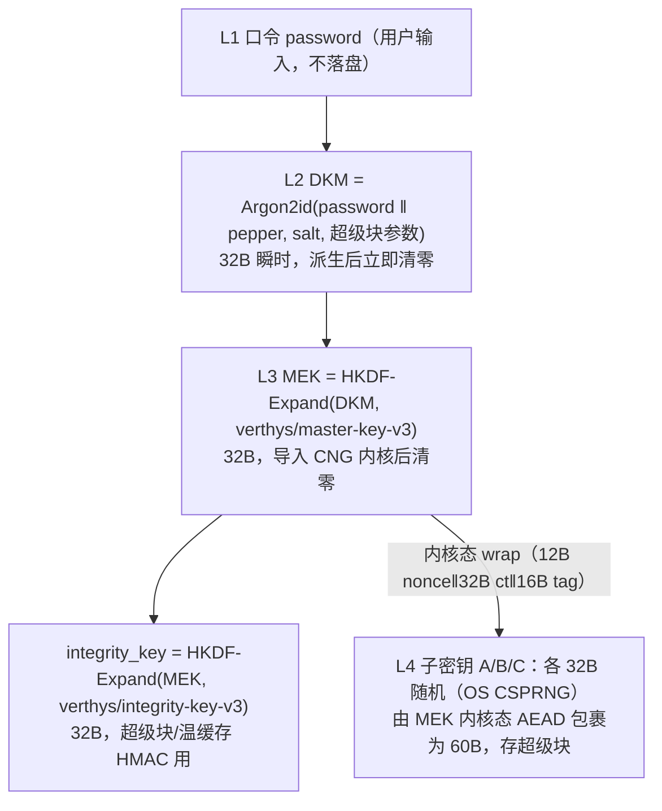
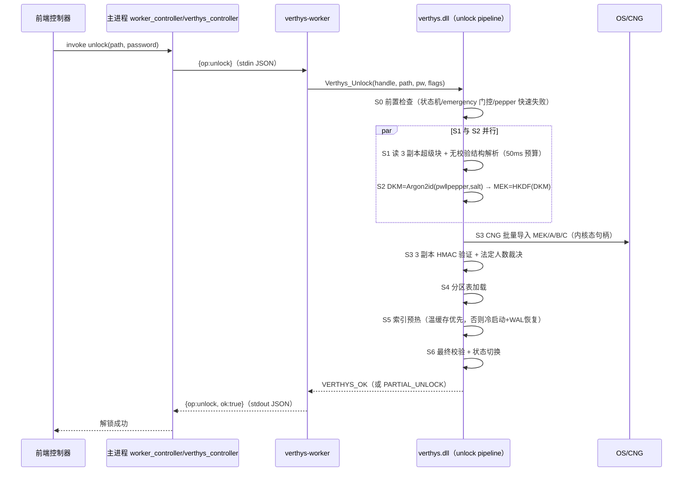
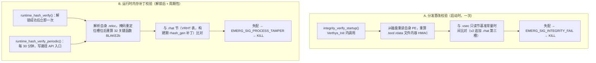

# SECURITY_DESIGN — Verthys 安全设计与信任模型

> 定义四层信任边界、密钥派生链路、哈希校验机制与威胁建模，供安全审计与应急处置参考。
>
> Last updated: 2026-09-19 · 维护人：K1Super

---

## 1. 信任边界

自底向上四条边界，密钥与明文只能单向向下沉降，任何一层不得向下层反授权。

- 边界 1↔2：跨此边界的唯一敏感数据是**口令**（调用后即清零）；传输走子进程管道。
- 边界 2↔3：只有 `verthys.h` 白名单 ABI 可进入 DLL；worker 加载 DLL 前完成进程级 mitigation 与 DLL SHA-256 预检。
- 边界 3↔4：落盘一律密文（分区 AEAD + 超级块 HMAC + Merkle）；只读回验，篡改即报应急。
- 密钥与明文只存在于边界 3 内（且密钥主体在 CNG 内核态），上两层为“零密钥接触”。

## 2. 密钥存储与派生链路

### 2.1 V3 密钥层级（以 `keymanager.h`/`keymanager_cng.h`/`verthys_v3_lifecycle.c` 为准）

- DKM 与 MEK 仅在解锁流水线 S2→S3 栈帧瞬态存在；`verthys_cng_aead_import_key` 是唯一允许密钥明文进入用户态栈帧的点，导入后 `SecureZeroMemory`。
- A/B/C 包装密钥经 CNG 内核态解包，解包输出为栈上瞬态，立即导入对应角色句柄并清零；进程终止时 CNG 自动回收内核态密钥，与“锁库即杀进程”语义一致。
- 记录级隔离：V3 数据经分区 B 密钥 AEAD 加密；v1/v2 遗留方案另派生 `record_key = HKDF(key_b, record_id)` 实现逐条隔离。

### 2.2 胡椒（pepper）三层来源

> `core/src/crypto/pepper/verthys_pepper.h` 定义；**编译内嵌胡椒为内部常量，本文档不抄录明文**，仅描述机制。

按优先级降序：

1. **注入胡椒**：调度层经 `verthys_pepper_inject` 从 OS 密钥存储（TPM/CNG/Keychain）注入，部署首选。
2. **OS 托管胡椒**：`verthys_pepper_load_from_os` 从 CNG 持久化机器密钥读取（TPM 绑定）；首次自动生成并持久化到 `%APPDATA%\Verthys\pepper.bin`（v2 布局 304B，含 `source_type` + `source_fingerprint`，机器密钥 RSA-OAEP 包裹，OAEP label = 硬件指纹）。解包失败 → 置来源错误，**禁止静默兜底**，解锁返回 `VERTHYS_ERR_PEPPER_SOURCE`（0x0C），提示“保险库安全源已变更”。
3. **编译内嵌胡椒**：确定性兜底常量，保证零配置可开箱（来源随容器记录于超级块 flags，解锁时校验一致性防漂移）。

胡椒恢复：`verthys_pepper_export_shamir / reconstruct_shamir`（GF(2^8) Shamir 秘密共享，threshold k-of-n）生成恢复卡分片。

### 2.3 机器绑定

`layer3_hw_binding` 三件套：`cng_machine_key`（CNG 持久化 RSA 机器密钥，wrap/unwrap 胡椒）、`hardware_binding`（system_instance 硬件指纹，作为 OAEP label 与跨设备校验依据）、`system32_loader`（系统目录优先加载）。跨设备迁移时胡椒解包认证失败 → 直接拒绝，对应防御路径 `CROSS_DEVICE`（见 §5）。

### 2.4 关于 “.vsec / .rhat”

澄清：`.vsec`（DLL 只读节，构建期签名基线）与 `.rhat`（DLL 只读节，运行时函数哈希表）是**完整性校验数据**，不是密钥存储；密钥的“拆分存储”体现为 V3 超级块内 `wrapped_key_a/b/c` 三份包装密钥与 3 副本超级块，而非文件级拆分。详见 §4 与 [ARCHITECTURE.md](ARCHITECTURE.md) §2.5。
## 3. 解锁流程数据流

以 `verthys_unlock_pipeline.h` 的 S0–S6 为准（与《解锁.md》一致）。

## 4. 恶意软件哈希校验链路

两层互补（读 `security/integrity/integrity.c` 与 `runtime_hash.c/h`、`core/tools/rhash_gen.c`）：

- **校验什么**：A 校验 DLL 文件 `.text`/`.rdata`（含 `.rhat`）未能被替换/篡改；B 校验 32 个关键函数（加解密主路径、密钥组生命周期、轮换、超块事务、分区表、WAL、六 Phase 事务、LSM、解锁流水线、应急、完整性、`runtime_hash_scan` 自身）的**内存映像**未被 hotpatch。
- **何时执行**：A 在 `Verthys_Init`（`integrity_verify_startup`）；B 在解锁成功后一次 + 之后每次写路径 API（Add/Delete/Import/ChangePassword/Flush）经 `runtime_hash_verify_periodic` 时间门控重算（30 分钟间隔）。
- **惩罚**：失配即 `emergency_report(KILL, ...)` → 内存绝育 + 终止进程；`.rhat` 表自身纳入 `.vsec` HMAC（防文件级改表）。
- 构建闭环：`core/tools/rhash_gen.c --patch <dll|exe>` 解析 map 文件（符号 RVA）+ `.pdata`（函数边界）+ `.reloc`（重定位表），对 X 清单函数计算 BLAKE2b 补丁 `.rhat`；清单以 X-macro 单源定义，删改任一符号即构建失败（禁静默降级）。

## 5. 威胁建模（STRIDE 摘要）

| 威胁类别 | 攻击示例 | 防线模块 | 说明 |
|---|---|---|---|
| Spoofing 欺骗 | 伪冒合法进程/调用方 | brute_force（限流 + 一次性 auth_token）、session 守卫 | 解锁尝试限流，敏感命令需令牌 |
| Tampering 篡改 | 改 DLL/改 .verthys/内存补丁 | integrity（.vsec+.rhat）、superblock HMAC、Merkle、partition AEAD | 三类篡改各有信号（INTEGRITY_FAIL / PROCESS_TAMPER / SUPERBLOCK_HMAC） |
| Repudiation 抵赖 | 操作无痕 | util/audit_log.rs + security_commands/audit.rs | 安全命令写入审计日志（AEAD 保护） |
| Information Disclosure 泄露 | 读内存/转储/冷启动 | CNG 内核托管 + memory_guard + secure_allocator + key_separation | 密钥内核态不可读；明文缓冲用后清零 |
| Denial of Service 拒绝服务 | 资源耗尽/暴力爆破 | emergency（分级响应）+ 资源上限（512MB/句柄/线程）+ brute_force | 达到预算拒绝新操作、熔断 |
| Elevation of Privilege 提权 | 注入/Hook/进程镂空 | layer1 job_isolation、layer4 tls_loader+syscall_direct、layer5 process_sandbox、anti_inject | 进程级 mitigation + Job ACL 等效 PPL |

7 攻击路径闭环（`verthys.h VerthysDefensePath` = 内部 `DefensePath`）：挂起绕过 / 内存 Dump / 休眠取证 / IAT-Inline Hook / DLL 劫持·反射注入 / 进程读取 / 跨设备迁移，分别由 `layer1_process_guard`、`memory`、`layer4_hook_defense`、`layer5_sandbox + anti_analysis`、`layer3_hw_binding` 承接，`layer6_closure` 统一 BOOT/RUNTIME 校验（`Verthys_GetSecurityStatus` 反映 7 路径实时状态）。

## 6. 审计点清单

| 关键路径 | 审计点（函数/位置） |
|---|---|
| 解锁 | `Verthys_Unlock` → `verthys_unlock_pipeline_run`（S0–S6）；`keymanager_derive_master_v3`（DKM/MEK 派生即清零）；`verthys_cng_km_import_batch`（MEK 导入后清零） |
| 密钥注入/解包 | `verthys_cng_aead_import_key`、`verthys_cng_km_wrap_key`、`verthys_cng_km_rotate_abc` |
| pepper 来源 | `verthys_pepper_init / load_from_os`（来源错误置 `PEPPER_SOURCE`）、`pepper_source_error` |
| 改密/轮换 | `verthys_cng_km_verify_mek / rekey / rotate_mek`、`vsb_txn_v3_commit` |
| 导出 | `Verthys_Export`（流式、明文经用户态缓冲，用后清零）；导出密码不混胡椒 |
| 完整性校验 | `integrity_verify_startup`、`runtime_hash_verify(_periodic)`、`Verthys_VerifyIntegrity` |
| 应急自毁 | `emergency_report / emergency_trigger`（TELEMETRY/DEGRADE/KILL 三级） |
| 事务提交 | `vsb_v3_commit_quorum`（3 副本 2/3 成功）、WAL 回放 |